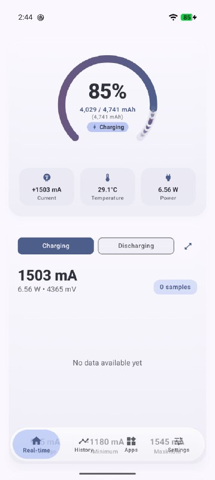
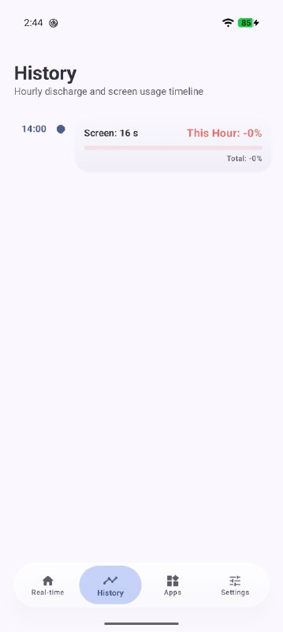
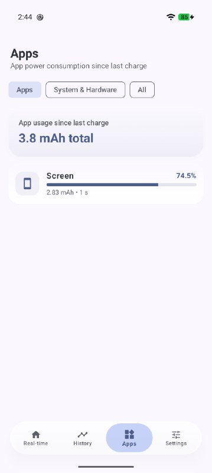
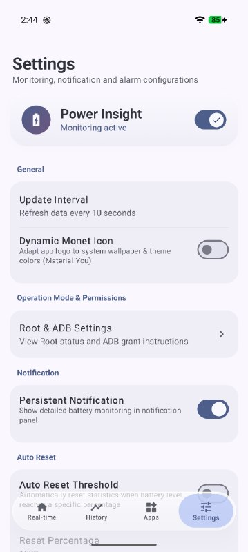

# BatteryInsight

[](LICENSE)
[](https://developer.android.com)
[](https://kotlinlang.org)
[](https://developer.android.com/jetpack/compose)

BatteryInsight is a lightweight, real-time battery analytics and hardware telemetry tool for Android. Designed for devices running AOSP, HyperOS, OneUI, and Pixel ROMs, it directly reads current, voltage, and power from kernel `sysfs` power supply nodes without incurring unnecessary background drain or UI overhead.

Built entirely with Kotlin and Jetpack Compose.

---

## Screenshots

<p align="center">
  
  
  
  
</p>

---

## Key Features

- **Direct Kernel Telemetry:** Reads real-time charging and discharging current (mA), bus voltage (mV), wattage (W), and battery temperature directly from sysfs driver nodes.
- **Persistent Status Bar Monitor:** Low-overhead foreground service with real-time stats and flicker-free updates. Dynamically formats durations (`X sa Y dk` / `X dk`).
- **Deep Sleep & Idle Analytics:** Accurate tracking of Screen On, Screen Off, and kernel Deep Sleep states to identify battery drain during standby.
- **Battery Health Tracking:** Reports battery cycle count, estimated capacity, and comparison against factory design capacity.
- **Per-App Attribution:** Detailed battery consumption breakdown powered by the Android BatteryStats subsystem.
- **Material You (Monet):** Native dynamic color palette integration with support for system-adaptive launcher icons.
- **Flexible Access Architecture:** Operates with full hardware capabilities via Root (KernelSU, Magisk, APatch) or unrooted via standard ADB permissions.

---

## Permissions & Setup

BatteryInsight operates in two distinct modes depending on device access:

### Root Mode (Recommended)
Grant superuser access when prompted by **KernelSU**, **Magisk**, or **APatch**. This allows direct access to restricted kernel sysfs nodes and hardware power rails.

### Non-Root (ADB) Mode
If your device is not rooted, grant the necessary system metrics permissions once via ADB:

```bash
adb shell pm grant com.acer.batteryinsight android.permission.BATTERY_STATS
adb shell pm grant com.acer.batteryinsight android.permission.PACKAGE_USAGE_STATS
adb shell pm grant com.acer.batteryinsight android.permission.DUMP
```

---

## Building from Source

### Prerequisites
- JDK 17 or higher
- Android SDK Platform 34
- Gradle 8.4+ (included via wrapper)

### Build Command
```bash
git clone https://github.com/acerhizmq/battery-insight.git
cd battery-insight
./gradlew assembleRelease
```

The compiled release package will be located at:
`BatteryInsight-v<version>-Universal.apk`

---

## Support & Contact

- Developer: [acerhizm](https://github.com/acerhizmq)
- Telegram: [@acerhizm](https://t.me/acerhizm)
- Issues & Discussions: Use GitHub Issues to submit bug reports, device-specific sysfs paths, or feature requests.

---

## License

This project is licensed under the terms of the GNU General Public License v3.0 ([GPLv3](LICENSE)).
